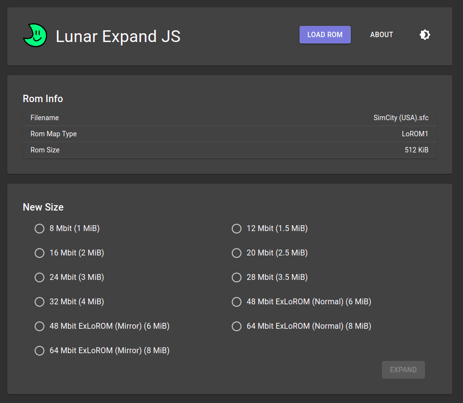

# Lunar Expand JS

## About
This is a JavaScript port of [Lunar Expand](https://www.romhacking.net/utilities/27/) and was made with the ReactJS framework.

Like with Lunar Address JS, I originally attempted to anaylze the program with IDA Pro. This proved more trouble than it was worth, especially considering the pseudo-code IDA Pro generated had a lot of gotos. As a result, it was much easier to just anaylze Lunar Expand's outputs and read SNES documentation.

This app can be accessed in your browser with the link below:

https://romh-acking.github.io/lunar-expand-JS/

## Limitations / Differences
* I excluded the option to convert from LoRom to HiRom and vice versa. 
* Lunar Expand doesn't recognize ExLoRom, therefore, Star Ocean, a commercially released 6MiB ExLoROM game, cannot be expanded in it. It can be in this program.

## Special Thanks
* PinoBatch: Guidance
* Sour: Guidance

## Some Notes
* Per PinoBatch, "Any LoROM of 16 Mbit or less can be expanded to a HiROM of twice the size by duplicating every 32K bank".
* https://problemkaputt.de/fullsnes.htm#snescartridgeromheader

